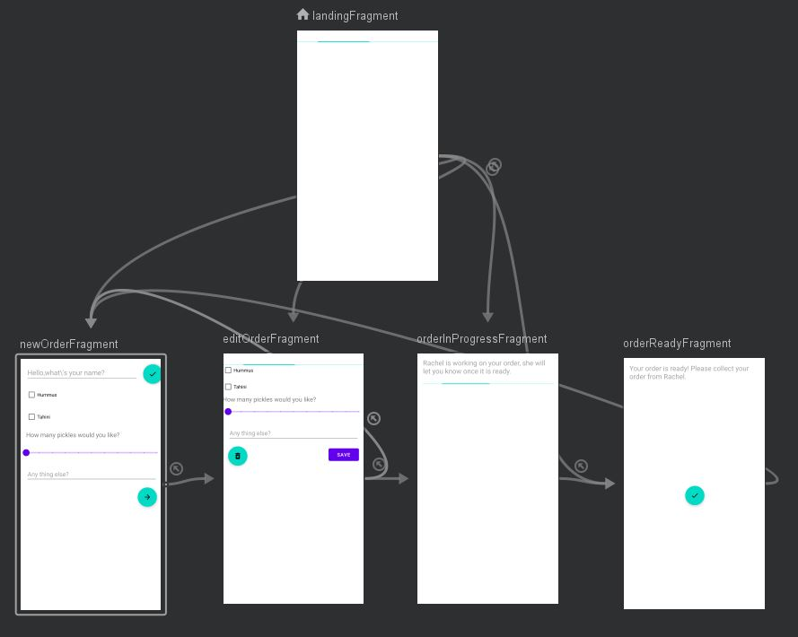

"# postpc-2021-ex7"

I pledge the highest level of ethical principles in support of academic excellence. 
I ensure that all of my work reflects my own abilities and not those of someone else.

# Sandwich order app

An application that allows customer to order sandwiches and see the status of their current order, ultimately letting them acknowledge they 
have collected it.
This exercise was meant to be solved by different activities and intents, but I chose to implement it using fragments and the navigation
component in order to learn it.
The navigation graph is as follows:

The first fragment is the LandingFragment which loads the data from the firestore database and opens the one of the following fragment
according to the order status:

* NewOrderFragment - no order currently exists. Customer can insert (and edit) his name here, and fill in the order details. Once the customer
clicks the 'next button', the order is created and uploaded into the firestore database, and the customer is navigated to the following fragment.

* EditOrderFragment - here the customer can edit his order details (but not his name). The customer will be in this screen until one of the
following 2 possibilities happen:
    1. The customer clicks the delete button - in this case the order is discarded, deleted from the db and the customer is moved back to the
    previous NewOrderFragment screen.
    2. The order's status was changed in the db from WAITING to IN_PROGRESS, and the customer is navigated to the following fragment.

* OrderInProgressFragment - a loading screen which the customer will see until the order is ready for him to collect. once the order's status
changed to DONE, the customer will be navigated to the following fragment.

* OrderReadyFragment - the order is marked as done, here the customer will click a button that marks his order as collected, the order will then
be deleted from the databases and the customer will be moved to the new order screen.

The app will only have 1 screen at any moment (e.g. tapping BACK from a screen will not get to any previous screen), implemented by the navigation
graph's popUpTo options.